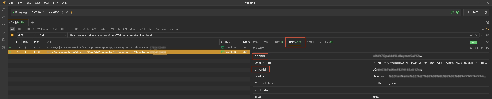

# 济南水务（JinanWater）

[English](README-en.md)

## 安装集成

### 方式一：HACS

点上面的按钮一键添加，或者手动操作：

1. 在 Home Assistant 中打开 **HACS**。
2. 进入 **集成** → 右上角菜单（⋮）→ **自定义仓库**。
3. 添加仓库 `https://github.com/mingyue5826/JinanWaterHA`，类别选 **集成（Integration）**。
4. 在 **济南水务** 卡片中点击 **下载**。
5. 按提示 **重启** Home Assistant。

### 方式二：手动安装

1. 将Release中的的文件解压后复制到 Home Assistant 配置目录下：

   `config/custom_components/jinan_water/`

2. **重启** Home Assistant。

## 添加设备

1. 打开 **设置** → **设备与服务** → **添加集成**。
2. 搜索 **济南水务**（或 **JinanWater**）并选择。
3. 输入以下信息（信息获取方式见）。
   - openid
   - unionid
   - 微信实名姓名
   - 微信实名手机号
4. 勾选要添加的一个或多个 **户号**，完成向导。

### 信息获取方式

配置信息需要小程序抓包，建议用电脑端微信小程序进行抓包，手机抓包需要root或其他复杂方式

1. 选择适合自己设备的架构和版本下载并安装。[下载链接](https://reqable.com/zh-CN/download/)
2. 启动抓包工具
3. 打开微信小程序，进入济南水务，用微信账号进行登录
4. 在抓包工具中搜索`https://yx.jinanwater.cn/shoufeizjj3/api/WxProgramApi/GetBangDingList`
5. 双击抓包结果，在右侧找到`请求头`
6. 请求头中就存在`openid`和`unionid`

